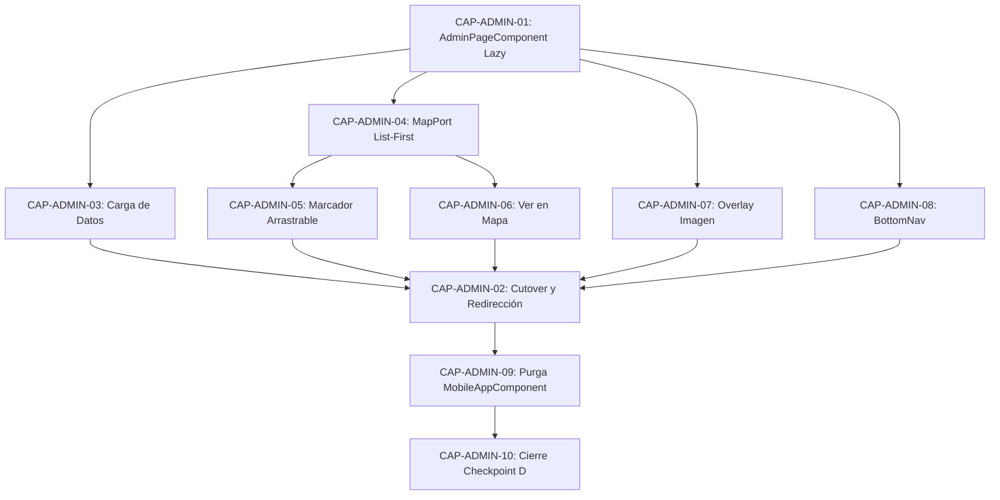
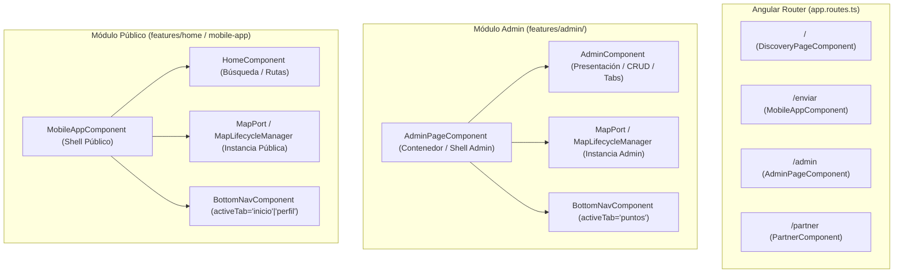

# T29: Extracción de Admin en Contenedor y Ruta Propia

## 1. Estado Actual con Evidencia (Ruta:Línea)

La arquitectura actual mantiene un acoplamiento directo entre el shell público (`MobileAppComponent`) y la superficie de administración (`AdminComponent`), impidiendo el aislamiento de responsabilidades y manteniendo pendiente el cumplimiento de **Checkpoint D** ("Panel empresarial no comparte estado con búsqueda pública").

### 1.1 Configuración de Rutas
- `frontend/src/app/app.routes.ts:10-14`: La ruta `/admin` aún delega la carga perezosa a `MobileAppComponent` con un valor por defecto en `data`:
  ```typescript
  {
    path: 'admin',
    data: { defaultTab: 'puntos' },
    loadComponent: () => import('./mobile-app.component').then(module => module.MobileAppComponent)
  }
  ```
  Esto convierte al shell público en el anfitrión de la lógica administrativa, obligándolo a cargar y mantener el ciclo de vida del panel.

### 1.2 Acoplamiento en `MobileAppComponent`
- `frontend/src/app/mobile-app.component.ts:17`: Importación directa de `AdminComponent`.
- `frontend/src/app/mobile-app.component.ts:46`: Inclusión de `AdminComponent` en el arreglo `imports` del componente standalone.
- `frontend/src/app/mobile-app.component.ts:59`: Inyección de vista mediante `@ViewChild('adminRef') adminRef!: AdminComponent;`.
- `frontend/src/app/mobile-app.component.ts:66-67`: Campos de estado `activeMainTab: MainTab = 'inicio';` e `isMapForcedVisible: boolean = false;` utilizados para conmutar la visibilidad entre el mapa del shell y el contenido de administración.
- `frontend/src/app/mobile-app.component.ts:72`: Campo huérfano `isPickingLocation: boolean = false;` conservado por compatibilidad de plantilla.
- `frontend/src/app/mobile-app.component.ts:30-38` y `109-111`: Función `resolveMainTab` y suscripción a `queryParams` que resuelven `'puntos'` como pestaña interna del shell.
- `frontend/src/app/mobile-app.component.ts:719-735`: Método `viewOnMap(loc, pointRole)` que conmuta `activeMainTab = 'inicio'`, forzando al usuario a abandonar la pestaña administrativa para ver un punto en el mapa público.
- `frontend/src/app/mobile-app.component.ts:834-853`: Método `previewMap(coords)` que manipula el mapa del shell y asocia un marcador auxiliar arrastrable (`AUX_MARKER_KEYS.PREVIEW`), invocando directamente a `this.adminRef.updatePickedLocation(pos.lat.toFixed(6), pos.lng.toFixed(6))` al finalizar el arrastre (`onDragEnd`).

### 1.3 Acoplamiento en Plantilla del Shell
- `frontend/src/app/mobile-app.component.html:3`: La visibilidad de `<app-home>` depende de flags administrativos:
  ```html
  <div class="inicio-tab-content" [hidden]="activeMainTab !== 'inicio' && !isPickingLocation && !isMapForcedVisible">
  ```
- `frontend/src/app/mobile-app.component.html:25-33`: Renderizado condicional de `<app-admin>` dentro del shell:
  ```html
  <div class="admin-tab-content" *ngIf="activeMainTab === 'puntos' && !isPickingLocation">
    <app-admin #adminRef
      [locations]="locations"
      (viewOnMapEvent)="viewOnMap($event)"
      (minimizeModalEvent)="isMapForcedVisible = $event"
      (previewMapEvent)="previewMap($event)"
      (previewImageEvent)="fullScreenImage = $event"
    ></app-admin>
  </div>
  ```

### 1.4 Acoplamiento en Pruebas Unitarias
- `frontend/src/app/mobile-app.component.spec.ts:8`: Import de `AdminComponent`.
- `frontend/src/app/mobile-app.component.spec.ts:46, 191, 269`: Sobrescrituras del template de `AdminComponent` (`overrideComponent(AdminComponent, { set: { template: '' } })`) para evitar errores en pruebas unitarias del shell.
- `frontend/src/app/mobile-app.component.spec.ts:356-370`: Pruebas de caracterización de `resolveMainTab` que evalúan la resolución de `'puntos'`.

### 1.5 Estado de Transición en `tasks/todo.md`
- `tasks/todo.md:201-202`: T29 pendiente, con T29a completada (estableció el enlace Panel hacia `/admin` en `BottomNavComponent` y un límite de navegación previo). La extracción física de `AdminComponent` y su estado fuera de `MobileAppComponent` permanece sin ejecutar.
- `tasks/todo.md:230`: `[ ] Panel empresarial no comparte estado con búsqueda pública` (Único ítem pendiente de **Checkpoint D**).

---

## 2. Supuestos Explícitos

1. **Invarianza de Backend y Contratos:** No se alteran contratos HTTP, controladores Express, PostgreSQL, SQL, migraciones ni seeds. No se agregan librerías npm ni dependencias de infraestructura.
2. **Preservación Estricta de Partner:** `PartnerComponent` (`/partner`) permanece completamente intacto. No se modifican sus rutas, servicios, estilos ni dependencias con Mapbox.
3. **Ausencia de Autenticación Nueva:** No se implementa ningún flujo de login, tokens JWT ni guards de autenticación nuevos para `/admin`. El acceso permanece como hasta ahora, conservando el modal/prompt existente `checkB2BPassword()` que conecta hacia `/partner`.
4. **Reutilización del Motor de Mapa Unificado:** No se duplica código ni se crea un segundo motor de mapa. Se reutilizan estrictamente los contratos e implementaciones existentes de `MapPort`, `MapLibreMapAdapter`, `MapLifecycleManager`, `MapCapabilityService` y la fábrica `createMapMarkerElement`.
5. **Filosofía List-First para Admin:** La vista principal de `/admin` es la lista administrativa (tabs de Empresas y Puntos). El mapa WebGL **no se inicializa en el arranque inicial**; se inicializa de manera diferida (on-demand) solo cuando el usuario ejecuta una acción espacial explícita ("Ver en Mapa", previsualizar o arrastrar marcador).
6. **Desacoplamiento de Datos de Red:** La petición a `/api/empresas` y `/api/locations` dentro del contexto administrativo ocurre únicamente dentro de la superficie administrativa (`AdminPageComponent` y `AdminComponent`). El shell público (`/enviar` e Inicio `/`) no consulta empresas ni retiene estado administrativo.
7. **Redirección de Compatibilidad sin Bucle:** El acceso legado `/enviar?tab=puntos` se redirige a `/admin` dentro de la misma navegación. La semántica real de `back`/`forward` se considera un criterio E2E y no se infiere únicamente por devolver un `UrlTree`.
8. **Granularidad de Slices:** Cada slice afectará un máximo de 5 archivos físicos, será atómico, reversible y contará con criterios de aceptación verificables.
9. **Registro de Nuevos Puntos Fuera de T29:** `navigateToRegistro` se emite actualmente sin consumidor ni componente de registro existente. T29 documenta esa brecha y conserva la paridad actual; no inventa un formulario, endpoint o toast que simule una operación inexistente.

---

## 3. Capability Map

| ID | Nombre | Descripción | Dependencias | Orden de Ejecución |
| :--- | :--- | :--- | :--- | :---: |
| **CAP-ADMIN-01** | Contenedor Lazy de Administración | Crear `AdminPageComponent` como contenedor exclusivo para la ruta `/admin` en `features/admin/`. | Ninguna | 1 |
| **CAP-ADMIN-03** | Carga y Ciclo de Datos Administrativos | Gestión de `locations` vía `UbicacionesService` y refresco ante eventos de mutación (`locationUpdated`). | CAP-ADMIN-01 | 2 |
| **CAP-ADMIN-07** | Overlay de Imagen Ampliada | Visualización modal a pantalla completa de imágenes emitidas por `previewImageEvent`. | CAP-ADMIN-01 | 3 |
| **CAP-ADMIN-08** | Navegación Inferior Persistente | Inclusión de `BottomNavComponent` con `activeTab="puntos"` en el contenedor administrativo. | CAP-ADMIN-01 | 4 |
| **CAP-ADMIN-04** | Integración List-First de `MapPort` | Contenedor de mapa diferido que inicializa `MapLibreMapAdapter` y `MapLifecycleManager` solo bajo demanda. | CAP-ADMIN-01 | 5 |
| **CAP-ADMIN-05** | Marcador de Previsualización Arrastrable | Soporte para `previewMapEvent` con marcador auxiliar arrastrable (`preview`) que actualiza coordenadas bidireccionalmente. | CAP-ADMIN-04 | 6 |
| **CAP-ADMIN-06** | Modo "Ver en Mapa" en Admin | Visualización enfocada de un punto en el mapa con botón de retorno al listado sin cambiar de ruta. | CAP-ADMIN-04 | 7 |
| **CAP-ADMIN-02** | Cutover y Redirección de Compatibilidad | `/admin` cambia al contenedor probado y un guard intercepta `/enviar?tab=puntos` sin introducir un bucle de historial. | CAP-ADMIN-01, CAP-ADMIN-03..08 | 8 |
| **CAP-ADMIN-09** | Purga de Admin en `MobileAppComponent` | Retiro total de imports, referencias, métodos, estado y marcado de admin en el shell público. | CAP-ADMIN-01..08 | 9 |
| **CAP-ADMIN-10** | Aislamiento y Cierre Checkpoint D | Verificación de que el shell público y el panel empresarial no comparten memoria ni red. | CAP-ADMIN-09 | 10 |



---

## 4. Arquitectura Destino y Ownership

### 4.1 Separación de Contenedores y Rutas



### 4.2 Matriz de Ownership de Estado y Eventos

| Dominio de Estado / Responsabilidad | Dueño Anterior (Monolito) | Dueño Destino | Justificación |
| :--- | :--- | :--- | :--- |
| **Ruta `/admin`** | `MobileAppComponent` | `AdminPageComponent` | Contenedor dedicado, desacoplado del bundle público. |
| **Listado y Filtros de Empresas** | `AdminComponent` | `AdminComponent` | Lógica de presentación y filtrado estrictamente local. |
| **Listado y Filtros de Puntos** | `AdminComponent` | `AdminComponent` | Paginación y búsqueda textual local en el panel. |
| **Formularios de Edición/Creación** | `AdminComponent` | `AdminComponent` | Estado temporal de edición (nombre, horarios, imágenes). |
| **Colección `locations` de Admin** | `MobileAppComponent` | `AdminPageComponent` | Suministrada a `AdminComponent` y sincronizada ante `locationUpdated`. |
| **Ciclo de Vida de Mapa en Admin** | `MobileAppComponent` | `AdminPageComponent` | Inicialización list-first, resize observer y destrucción limpia de MapLibre. |
| **Marcador Arrastrable (`preview`)** | `MobileAppComponent` | `AdminPageComponent` | Manipulación de coordenadas espaciales vía `MapLifecycleManager`. |
| **Overlay Imagen Ampliada** | `MobileAppComponent` | `AdminPageComponent` | Diálogo accesible para inspección visual de comprobantes. |
| **Pestañas Públicas (`inicio`/`perfil`)** | `MobileAppComponent` | `MobileAppComponent` | Dominio exclusivo del flujo de envíos del cliente. |
| **Búsqueda y Rutas Públicas** | `MobileAppComponent` | `HomeComponent` / Facade | Aislamiento completo respecto al panel administrativo. |

---

## 5. Contrato de Navegación y Compatibilidad

### 5.1 Matriz de Comportamiento de Rutas

| URL Solicitada | Condición / Parámetros | Manejador / Guard | Componente Activo | Estado Visual / Tab | Historial (Back/Forward) |
| :--- | :--- | :--- | :--- | :--- | :--- |
| `/admin` | Ninguna | Carga directa | `AdminPageComponent` | Pestaña Puntos/Empresas (List-First, mapa apagado). | Preserva navegación normal. |
| `/enviar?tab=puntos` | `tab=puntos` presente | `legacyAdminRedirectGuard` | Redirección inmediata a `/admin` | Carga `AdminPageComponent` sin renderizar `MobileAppComponent`. | La matriz E2E debe demostrar que "Atrás" regresa a la pantalla previa sin caer en bucle. |
| `/enviar` | Sin parámetros | Carga directa | `MobileAppComponent` | Flujo público: Inicio / Búsqueda. | Entrada limpia al historial. |
| `/enviar?tab=perfil` | `tab=perfil` presente | Carga directa | `MobileAppComponent` | Pestaña Perfil del usuario público. | Preserva navegación normal. |
| `/` | Ninguna | Carga directa | `DiscoveryPageComponent` | Catálogo público y accesos rápidos. | Raíz de navegación. |
| `#/partner` | Disparado desde Admin | Password prompt `admin123` | `PartnerComponent` | Dashboard de socio/empresa. | Preserva hash de Partner. |

### 5.2 Algoritmo del Guard de Redirección (`legacy-admin-redirect.guard.ts`)
```typescript
export const legacyAdminRedirectGuard: CanActivateFn = (route, state) => {
  if (route.queryParams['tab'] === 'puntos') {
    const router = inject(Router);
    // El redirect pertenece a la navegación pendiente; el historial se verifica mediante E2E.
    return router.createUrlTree(['/admin']);
  }
  return true;
};
```

---

## 6. Tabla Completa de Eventos Admin -> Contenedor

| Evento Emitido (`@Output`) | Tipo de Payload | Origen en `AdminComponent` | Método en `AdminPageComponent` | Mutación de Estado en Contenedor | Acción sobre `MapPort` / `MapLifecycleManager` | Efecto Visual / UX |
| :--- | :--- | :--- | :--- | :--- | :--- | :--- |
| `viewOnMapEvent` | `any` (Punto / `DeliveryPoint`) | Clic en botón "Ver en Mapa" en modal de detalles (`admin.component.html:220`) | `onViewOnMap(point)` | Activa `isMapActive = true`; almacena `selectedPoint = point`. | Inicializa `MapPort` si no existe; limpia marcadores primarios; agrega marcador `'destination'`; vuela a coordenadas (`flyTo(coords, { zoom: 17 })`). | Oculta listado; despliega mapa interactivo enfocado con botón "← Volver al listado". |
| `previewMapEvent` | `{ lat: number, lng: number }` | Clic en botón "Ver en Mapa" en formulario de edición (`admin.component.ts:472`) | `onPreviewMap(coords)` | Asegura visibilidad del mapa de fondo (`isMapActive = true`). | Inicializa `MapPort` si no existe; vuela a `coords` (`zoom: 18`); registra marcador auxiliar `AUX_MARKER_KEYS.PREVIEW` con `draggable: true`; al arrastrar (`onDragEnd`), invoca `this.adminRef.updatePickedLocation(pos.lat, pos.lng)`. | Muestra el mapa centrado en el punto con marcador arrastrable interactivo. |
| `minimizeModalEvent` | `boolean` (`true` al minimizar, `false` al restaurar) | Disparado por `minimizeModal()` y `restoreModal()` (`admin.component.ts:337, 470, 478, 485`) | `onMinimizeModal(isMinimized)` | Actualiza `isModalMinimized = isMinimized`. | Ninguna directamente; mantiene mapa visible de fondo. | Permite que el mapa ocupe la pantalla mientras la barra de edición minimizada ("Verifica la ubicación") flota encima. |
| `previewImageEvent` | `string` (URL completa de la imagen) | Clic en capa de previsualización en modal de detalles (`admin.component.ts:323`) | `onPreviewImage(url)` | Asigna `fullScreenImage = url`. | Ninguna. | Despliega overlay modal a pantalla completa con imagen ampliada y botón de cierre (`&times;`). |
| `locationUpdated` | `void` o `any` | Guardado exitoso de punto (`admin.component.ts:601`) | `onLocationUpdated()` | Solicita recarga de ubicaciones a `UbicacionesService`. | Actualiza marcadores activos si el mapa estuviera visible. | Los datos en la lista y mapa quedan actualizados con la respuesta del servidor. |
| `requestMapPick` | `any` (`editFormData`) | Clic en "📍 Ubicar manualmente en mapa" (`admin.component.ts:380`) | `onRequestMapPick(formData)` | Activa modo de selección espacial en el contenedor; minimiza modal. | Centra mapa en coordenadas existentes o por defecto de El Salvador; coloca marcador arrastrable interactivo. | Permite al administrador arrastrar el pin para definir lat/lng cuando no había coordenadas. |
| `navigateToRegistro` | `{ id: number \| null, nombre: string }` | Clic en "Agregar Punto" en menú de empresa o FAB '+' de puntos (`admin.component.ts:198, 202`) | Sin consumidor en T29; brecha documentada para una fase funcional posterior. | Ninguna. | Ninguna. | Mantiene la paridad actual sin inventar un registro o una confirmación falsa. |

---

## 7. Plan de Slices de Implementación

Cada slice afecta **un máximo de 5 archivos físicos**, mantiene el sistema verde (`npm run test:ci && npm run build`) y es atómicamente reversible.

### Slice T29b: Contenedor Administrativo Aislado (sin Cutover)
- **Objetivo:** Crear `AdminPageComponent` en `frontend/src/app/features/admin/admin-page.component.ts` y conectar la carga de datos (`UbicacionesService`), el visor de imagen y el `BottomNavComponent`. La ruta `/admin` continúa apuntando temporalmente al shell anterior hasta que el mapa del nuevo contenedor esté completo; así cada commit permanece desplegable.
- **Archivos Autorizados (Máximo 5):**
  1. `frontend/src/app/features/admin/admin-page.component.ts` (Nuevo)
  2. `frontend/src/app/features/admin/admin-page.component.html` (Nuevo)
  3. `frontend/src/app/features/admin/admin-page.component.css` (Nuevo)
  4. `frontend/src/app/features/admin/admin-page.component.spec.ts` (Nuevo)
- **Archivos Prohibidos:** `mobile-app.component.*`, `home.component.*`, `partner.component.*`.
- **Criterios de Aceptación:**
  1. `AdminPageComponent` se compila y renderiza `<app-admin>` con `locations` provenientes de `UbicacionesService.getLocations()`.
  2. Muestra `<app-bottom-nav activeTab="puntos">` anclado al fondo.
  3. Maneja `(previewImageEvent)` renderizando el overlay modal de imagen ampliada con `role="dialog"`, `aria-modal="true"` y cierre con `ESC` o clic en backdrop.
  4. La ruta `/admin` todavía conserva el contenedor anterior durante este slice; ninguna acción de mapa pierde funcionalidad entre commits.
  5. La suite completa pasa con pruebas unitarias que validan la inicialización del contenedor y la carga de datos sin errores de compilación ni de límites (`check:boundaries`).
- **Pruebas:** Pruebas unitarias en `admin-page.component.spec.ts` con mock de `UbicacionesService` y `ToastService`.
- **Rollback:** revertir el commit que añade `frontend/src/app/features/admin/admin-page.component.*`; no existe cambio de routing en este slice.

---

### Slice T29c: Integración de Mapa List-First y Marcador Arrastrable en Admin
- **Objetivo:** Dotar a `AdminPageComponent` de soporte de mapa interactivo reutilizando `MapPort`, `MapLibreMapAdapter`, `MapLifecycleManager`, `MapCapabilityService` y `createMapMarkerElement`. Cumplir la preferencia list-first (mapa inactivo por defecto) y soportar el arrastre de coordenadas en previsualización.
- **Archivos Autorizados (Máximo 5):**
  1. `frontend/src/app/features/admin/admin-page.component.ts`
  2. `frontend/src/app/features/admin/admin-page.component.html`
  3. `frontend/src/app/features/admin/admin-page.component.css`
  4. `frontend/src/app/features/admin/admin-page.component.spec.ts`
- **Archivos Prohibidos:** `mobile-app.component.*`, archivos en `core/maps/` (no modificar contratos ni adaptadores existentes).
- **Criterios de Aceptación:**
  1. Al montar `/admin`, el mapa WebGL no se inicializa (modo lista puro, cero consumo de canvas WebGL).
  2. Al emitirse `viewOnMapEvent`, el contenedor activa el canvas de mapa `#admin-map`, inicializa `MapPort` + `MapLifecycleManager` si es la primera vez, añade el marcador del punto y ofrece un botón "← Volver a la lista".
  3. Al emitirse `previewMapEvent`, el contenedor activa el mapa, vuela a las coordenadas y registra el marcador auxiliar `preview` (`createMapMarkerElement(document, 'preview', ...)` con `draggable: true`).
  4. Al soltar el marcador arrastrado (`onDragEnd`), se invoca automáticamente `adminRef.updatePickedLocation(lat, lng)`.
  5. Si WebGL2 no está disponible (`MapCapabilityService`), muestra un banner de fallback accesible sin bloquear la edición de datos.
  6. En `ngOnDestroy`, destruye de forma segura `mapLifecycle?.destroy()` —que ya destruye el `MapPort`— y el `ResizeObserver`; no invoca `map.destroy()` por segunda vez.
- **Pruebas:** Pruebas unitarias verificando la creación perezosa del adaptador de mapa, actualización de coordenadas en `onDragEnd` y teardown en destrucción.
- **Rollback:** Revertir los cambios en los archivos del componente `admin-page`.

---

### Slice T29d: Cutover de `/admin` y Redirección Compatible sin Bucle
- **Objetivo:** Cambiar `/admin` al nuevo `AdminPageComponent`, crear el guard `legacyAdminRedirectGuard` y asociarlo a `/enviar` para redirigir peticiones legadas de forma transparente. El cutover sucede solo después de que T29c haya completado y probado el mapa administrativo.
- **Archivos Autorizados (Máximo 5):**
  1. `frontend/src/app/core/guards/legacy-admin-redirect.guard.ts` (Nuevo)
  2. `frontend/src/app/core/guards/legacy-admin-redirect.guard.spec.ts` (Nuevo)
  3. `frontend/src/app/app.routes.ts`
  4. `frontend/e2e/admin-route-boundary.pw.spec.ts` (Nuevo)
- **Archivos Prohibidos:** `partner.component.*`, `home.component.*`.
- **Criterios de Aceptación:**
  1. `/admin` carga perezosamente `AdminPageComponent`, ya cubierto por las pruebas de T29b/T29c.
  2. Una navegación hacia `/enviar?tab=puntos` es interceptada por `legacyAdminRedirectGuard`, retornando `router.createUrlTree(['/admin'])`, y la URL visible termina en `/admin`.
  3. El historial del navegador no retiene `/enviar?tab=puntos` como una página intermedia insalvable; presionar "Atrás" retorna a la página anterior a la navegación.
  4. Si se accede a `/enviar` sin query params o con `tab=perfil` o `buscar=destino`, la navegación procede con normalidad hacia `MobileAppComponent`.
  5. 100% de cobertura en `legacy-admin-redirect.guard.spec.ts`.
- **Pruebas:** Pruebas unitarias de navegación simulando `ActivatedRouteSnapshot` con diferentes combinaciones de query params.
- **Rollback:** Eliminar los archivos del guard y restaurar `app.routes.ts`.

---

### Slice T29e: Purga de Admin en Shell Público (`MobileAppComponent`)
- **Objetivo:** Remover por completo `AdminComponent`, `@ViewChild('adminRef')`, `isMapForcedVisible`, `previewMap`, `activeMainTab === 'puntos'` y el bloque de plantilla correspondiente en `MobileAppComponent`.
- **Archivos Autorizados (Máximo 5):**
  1. `frontend/src/app/mobile-app.component.ts`
  2. `frontend/src/app/mobile-app.component.html`
  3. `frontend/src/app/mobile-app.component.spec.ts`
- **Archivos Prohibidos:** `admin.component.*`, `admin-page.component.*`.
- **Criterios de Aceptación:**
  1. `MobileAppComponent` no importa ni declara `AdminComponent` en sus metadatos standalone.
  2. Se eliminan las propiedades `@ViewChild('adminRef')`, `isMapForcedVisible` y el método `previewMap()`.
  3. La plantilla `mobile-app.component.html` elimina el bloque `<div class="admin-tab-content">` y su referencia a `<app-admin>`.
  4. La visibilidad de `<app-home>` simplifica su directiva `[hidden]="activeMainTab !== 'inicio'"`.
  5. `resolveMainTab` se simplifica para gestionar exclusivamente pestañas públicas (`'inicio'` y `'perfil'`); cualquier valor foráneo se resuelve a `'inicio'`.
  6. `mobile-app.component.spec.ts` retira todas las llamadas obsoletas a `.overrideComponent(AdminComponent, ...)`.
  7. La compilación de producción y las 311+ pruebas frontend se ejecutan en verde sin advertencias de tipos.
- **Pruebas:** Pruebas de regresión unitarias en `mobile-app.component.spec.ts`.
- **Rollback:** `git checkout HEAD -- frontend/src/app/mobile-app.component.*`.

---

### Slice T29f: Verificación Integral, Cierre Checkpoint D y Documentación
- **Objetivo:** Verificar exhaustivamente el cumplimiento de **Checkpoint D** ("Panel empresarial no comparte estado con búsqueda pública"), auditar fronteras arquitectónicas (`check:boundaries`), contratos de color (`check:css-colors`), suite E2E de Playwright y documentar el cierre en `tasks/todo.md`.
- **Archivos Autorizados (Máximo 5):**
  1. `tasks/todo.md`
  2. `tasks/specs/T29-admin-route-extraction.md`
- **Archivos Prohibidos:** Cualquier archivo fuente en `frontend/src/`.
- **Criterios de Aceptación:**
  1. T29 y el ítem pendiente de Checkpoint D en `tasks/todo.md` marcados como completados `[x]`.
  2. Auditoría de red confirma 0 llamadas a `/api/empresas` durante el ciclo de vida de la página de inicio o `/enviar`.
  3. Comprobación estricta de límites (`npm run check:boundaries`) con 0 violaciones entre features.
  4. Matriz completa de validación ejecutada y documentada.
- **Rollback:** `git checkout HEAD -- tasks/todo.md`.

---

## 8. Comandos Exactos de Validación

Los siguientes comandos deben ejecutarse desde la carpeta `frontend/`:

```bash
# 1. Validación de Fronteras Arquitectónicas (core / shared / features)
npm run check:boundaries

# 2. Validación del Contrato de Colores y Tokens CSS (SiVoy Signal)
npm run check:css-colors

# 3. Suite Completa de Pruebas Unitarias en Vitest
npm run test:ci

# 4. Prueba Focalizada de Administración
npx vitest run src/app/features/admin/admin-page.component.spec.ts

# 5. Prueba Focalizada del Guard de Redirección
npx vitest run src/app/core/guards/legacy-admin-redirect.guard.spec.ts

# 6. Prueba Focalizada del Shell Público Purgado
npx vitest run src/app/mobile-app.component.spec.ts

# 7. Compilación de Producción de Angular
npm run build

# 8. Suite E2E de Playwright (Verificación de flujos reales)
npm run e2e
```

---

## 9. Riesgos y Mitigaciones

| Riesgo Técnico Detectado | Impacto | Estrategia de Mitigación Concreta |
| :--- | :--- | :--- |
| **Fuga de Contexto WebGL al alternar entre `/enviar` y `/admin`** | Crítico (El navegador puede agotar los contextos WebGL disponibles y fallar el render). | Cada componente implementa `ngOnDestroy`; `MapLifecycleManager.destroy()` libera listeners, marcadores y destruye una sola vez el `MapPort`, además de desconectar el `ResizeObserver`. |
| **Bucle de Redirección ("Back Trap") en `/enviar?tab=puntos`** | Alto (El usuario presiona "Atrás" en `/admin` y queda atrapado volviendo a `/admin`). | El guard devuelve un `UrlTree` dentro de la navegación pendiente y una prueba Playwright valida el historial real; el comportamiento no se da por correcto solo por la forma del guard. |
| **Desincronización de Coordenadas al Arrastrar el Pin de Previsualización** | Medio (El formulario de edición de admin no recibe la lat/lng modificada). | El callback `onDragEnd` del marcador auxiliar invoca directamente `adminRef.updatePickedLocation(pos.lat.toFixed(6), pos.lng.toFixed(6))`, manteniendo la sincronía síncrona en el formulario. |
| **Violación de Fronteras de Módulos (`check:boundaries`)** | Alto (Fallo en gate de CI si `features/admin` importa de `features/home`). | `AdminPageComponent` reside dentro de `features/admin/` y consume exclusivamente servicios de `core/` y componentes de `shared/` (`BottomNavComponent`). No importa nada de `features/home` ni `features/discovery`. |
| **Degradación Visual en Viewport Móvil (386×912 px)** | Medio (Desalineación del panel o superposición con la navegación inferior). | Reutilización estricta de las clases existentes `.admin-tab-content`, `.admin-sticky-header` y los tokens de espaciado vigentes con `padding-bottom: 80px` para acomodar la barra inferior fija. |

---

## 10. Criterios de Éxito de Checkpoint D

Para dar por concluido el Checkpoint D y cerrar la fase de desacoplamiento arquitectónico, deben cumplirse las siguientes condiciones objetivas:

1. **Aislamiento Absoluto de Estado:** `MobileAppComponent` no contiene ninguna importación, plantilla, propiedad, servicio ni método relacionado con `AdminComponent` o gestión de empresas.
2. **Aislamiento en Red:**
   - La carga en frío de `/` y `/enviar` realiza **cero solicitudes** a `/api/empresas`.
   - La carga de `/admin` ejecuta su solicitud a `/api/empresas` y `/api/locations` únicamente cuando se monta su contenedor propio.
3. **Preservación Integral de Capacidades Administrativas:**
   - Listado paginado de empresas y puntos.
   - Creación y edición de empresas con subida de logo.
   - Edición de puntos con validación geográfica en El Salvador, extracción desde enlace de Google Maps y horarios agrupados.
   - Compartición nativa de puntos con descarga y reenvío de imagen (`shareLocation`).
   - Vista en mapa bajo demanda con marcador enfocado y retorno a la lista.
   - Previsualización en mapa con marcador interactivo arrastrable que actualiza automáticamente las coordenadas del formulario.
   - Diálogo modal de imagen a pantalla completa accesible.
   - Acceso B2B hacia `/partner` mediante prompt de contraseña intacto.
4. **Preservación del Shell Público:** Búsqueda de origen y destino, proyección de rutas, visualización de vuelos y cálculo ETA operan con idéntico comportamiento y rendimiento.
5. **Cero Timers o Listeners Huérfanos:** Todos los observadores de redimensión, timers de debouncing y listeners de eventos de mapa son destruidos de forma determinista al cambiar de ruta.

---

## 11. Preguntas Abiertas

> [!NOTE]
> Tras la auditoría exhaustiva del código fuente y de los consumidores en `mobile-app.component.ts`, `admin.component.ts` y las pruebas existentes, **no existen preguntas abiertas que bloqueen la preservación del comportamiento actual**.
>
> 1. `navigateToRegistro` se emite actualmente sin consumidor y no existe un componente de registro en el árbol actual. Se registra como deuda funcional fuera de T29; este plan no muestra éxito ni crea datos ficticios.
> 2. `requestMapPick` también carece hoy de consumidor, pero sí dispone del contrato necesario (`editFormData` + `updatePickedLocation`). T29c conecta ese contrato al mapa administrativo sin requerir cambios de backend.
